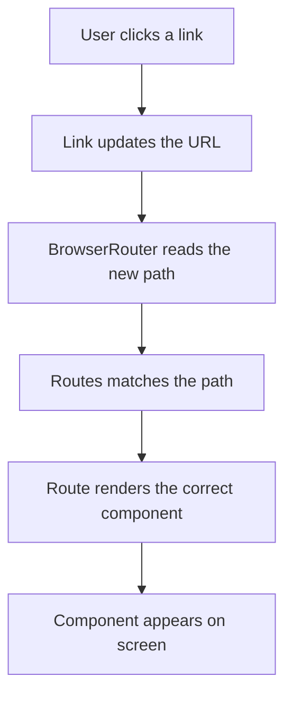

# Day 1 — React Router Basics

### 1. React Router basics

React Router helps us create navigation in a React app.

Core concepts:

- BrowserRouter → enables routing in the browser
- Routes → holds all route definitions
- Route → maps a URL path to a component
- Link → changes the URL without a full page reload
- Navigate → redirects to another route
- useNavigate → programmatically navigate to another page

## Why we use React Router

React Router is used to create navigation inside a React application without refreshing the whole page.

It is helpful because:

- it makes single-page applications feel smooth and fast
- it helps us move between pages like Home, About, Contact, or Course
- it keeps the URL in sync with the page the user is viewing
- it makes the app feel more professional and organized

## How we add React Router in a project

To use React Router in a React project, first install it:

```bash
npm install react-router-dom
```

Then wrap your app with BrowserRouter:

```jsx
import { BrowserRouter } from "react-router-dom";

ReactDOM.createRoot(document.getElementById("root")).render(
  <BrowserRouter>
    <App />
  </BrowserRouter>
);
```

After that, use Routes and Route to define pages.

## Definitions

- React Router: a library for handling navigation in React apps
- BrowserRouter: enables routing using the browser URL
- Routes: a container that holds all route definitions
- Route: maps a URL path to a specific component
- Link: creates a clickable navigation link without reloading the page
- Navigate: redirects the user to another page
- useNavigate: a hook used to navigate programmatically

## Core idea

Think of it like this:

- Link changes the URL
- Route decides which component should render

So the flow is:

1. User clicks a navigation link
2. React Router updates the browser URL
3. Routes checks the current path
4. The matching Route renders the correct component

## Example structure

```jsx
<BrowserRouter>
  <Navbar />
  <Routes>
    <Route path="/" element={<Home />} />
    <Route path="/about" element={<About />} />
    <Route path="/contact" element={<Contact />} />
  </Routes>
</BrowserRouter>
```

## Flow of navigation

When the user clicks “Course”:

```text
User clicks Course
    ↓
<Link to="/course">
    ↓
React Router updates the browser URL
    ↓
localhost:5173/course
    ↓
Routes checks the current path
    ↓
Matching Route is found
    ↓
<Course /> renders
```

## Flow diagram



## Important difference: Link vs anchor tag

This is one of the most important lessons:

- Link → updates the URL and lets React handle navigation smoothly
- Anchor tag `<a>` → causes a full page reload and requests the page from the server

So if you use an anchor tag, the page may reload completely. That is why React Router uses Link for SPA navigation.

## Quick takeaway

A good mental model is:

- Link = change the URL
- Route = decide what to show
- BrowserRouter = make client-side routing work

That is the foundation of navigation in a React application.
